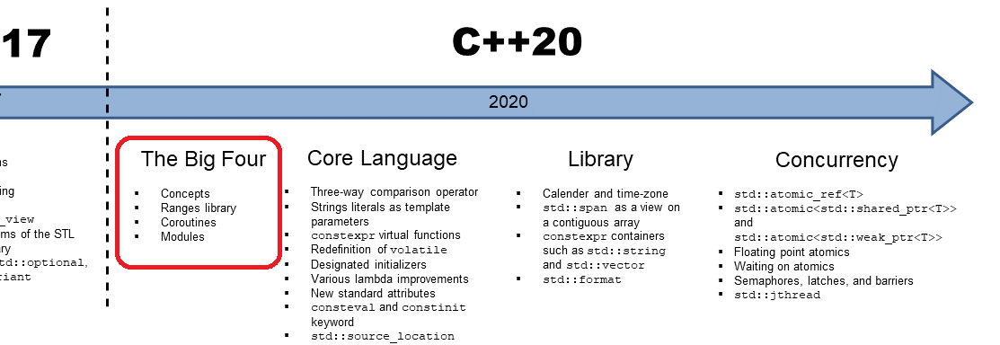

{: .mx-auto.d-block :}

C++ dilinde kod geliştiren yazılımcılar, dilin 1998 yılında standartlaşmasının ardından, 2011 yılında C++11 standardı çıkana kadar uzunca bir süre kullandıkları dilde bir değişim olmadan yazılımlarını geliştirmeye devam etmişlerdi. Bu zaman zarfında gelişen ve değişen dünyadaki problemlere çözüm bulmak, C++ dilinde gittikçe zorlaşmış, üçüncü parti kütüphane desteği olmadan güncel problemlere çözüm sunamayan eski kalmış bir dil haline gelmişti. C++ geliştiricileri, [Boost](https://www.boost.org/) gibi kütüphaneler olmadan diğer yazılım dillerinin sağladığı özellikler ile yarışamaz bir durumdaydılar.

Uzun bir aranın ardından yayınlanan C++11 standardı, mevcut dile birçok değişiklik getirmiş; C++ dilini adeta yeni bir dil haline getirmişti. [*Lambda Expressions*](https://en.cppreference.com/w/cpp/language/lambda), [*auto*](https://en.cppreference.com/w/cpp/language/auto), [*constexpr*](https://en.cppreference.com/w/cpp/language/constexpr), [*future*](https://en.cppreference.com/w/cpp/language/future) gibi yeni gelen özellikler ile bugün **Modern C++** olarak adlandırılan yeni bir dönem başlamış ve C++, diğer yazılım dilleri olan yarışında kendine tekrar üst sıralarda yer bulabilmişti.

C++11 ile başlayan ve her 3 yılda bir güncellenen standart, geleneğini C++20 güncellemesi ile devam ettiriyor. C++14 ve C++17 standartları, C++11 ile gelen özelliklerin güçlendirilmesi, daha çok derleyici zamanında kod çalıştırılması gibi yenilikler getirirken, dile çok fazla veya çok büyük yenilikler getirmemişlerdi. Ancak, C++20 standardı ile birlikte gelen 4 büyük yenilik ve birçok yeni iyileştirme sayesinde C++ dili, diğer diller ile olan rekabetinde yeni bir sayfa daha açacağa benziyor.  
Büyük dörtlü olarak ifade edilen, [*Concepts*](https://en.cppreference.com/w/cpp/language/constraints), [*Ranges*](https://en.cppreference.com/w/cpp/ranges), [*Coroutines*](https://en.cppreference.com/w/cpp/language/coroutines) ve [*Modules*](https://en.cppreference.com/w/cpp/language/modules) özelliklerinin dile eklenmesiyle birlikte, C++ dünyasını, tıpkı C++11 güncellemesi gibi büyük değişiklikler bekliyor.

Bu yazı dizisinde sizlere, yeni standartla beraber gelen bu 4 yeni ve büyük güncellemeyi tanıtarak, altında yatan tekniklerden ve kullanım şekillerinden bahsedeceğim.

---

## Part I - Constraints and Concepts

C++11 standardıyla birlikte gelen [*type_traits*](https://en.cppreference.com/w/cpp/header/type_traits) kütüphanesi ve [std::enable_if](https://en.cppreference.com/w/cpp/types/enable_if) kullanımı ile hayatımıza giren **SFINAE** *(Substition Failure Is Not An Error)* tanımı sayesinde, template kodların yönetilmesi ve hata durumlarında derleyicilerin daha okunabilir hatalar üretmesi mümkün hale gelmişti. Ancak hala bir template ifadenin nasıl kullanılması gerektiğini gösteren, okunurluğu arttıran bir yapı bulunmadığı için, template kullanımı her zamanki zorluğunu sürdürmekte; üretilen hata mesajlarının karmaşıklığı da devam etmekteydi.  
C++20 ile birlikte gelen konsept tanımı sayesinde bu problemlerin önüne geçilmesi hedefleniyor.

Örnek olarak standart kütüphanede yer alan `std::sort` fonksiyonunu ele alalım ve bir listenin elemanlarını sıralamak isteyelim:

```cpp
template <typename Iter>
void sort(Iter begin, Iter end) { ... }

int main()  {
  std::list<int> myints {1, 3, -5, 12, 0};
  std::sort(myints.begin(), myints.end());
}
```

Kodumuzu derlemek istediğimizde derleyici bize aşağıdaki gibi anlaşılması zor, karmaşık bir hata mesajı üretecektir
>**Visual Studio 2017 derleyici çıktısı:**

```sh
C:/...//list(1461): warning C4530: C++ exception handler used, but unwind semantics are not enabled. Specify /EHsc
C:/...//list(1423): note: see reference to function template instantiation 'void std::list<int,std::allocator<_Ty>>::_Insert_range<_Iter>(std::_List_unchecked_const_iterator<std::_List_val<std::_List_simple_types<_Ty>>,std::_Iterator_base0>,_Iter,_Iter,std::forward_iterator_tag)' being compiled
        with
        [
            _Ty=int,
            _Iter=const int *
        ]
C:/...//list(1422): note: see reference to function template instantiation 'void std::list<int,std::allocator<_Ty>>::_Insert_range<_Iter>(std::_List_unchecked_const_iterator<std::_List_val<std::_List_simple_types<_Ty>>,std::_Iterator_base0>,_Iter,_Iter,std::forward_iterator_tag)' being compiled
        with
        [
            _Ty=int,
            _Iter=const int *
        ]
C:/...//list(1097): note: see reference to function template instantiation 'std::_List_iterator<std::_List_val<std::_List_simple_types<int>>> std::list<int,std::allocator<_Ty>>::insert<const _Elem*>(std::_List_const_iterator<std::_List_val<std::_List_simple_types<_Ty>>>,_Iter,_Iter)' being compiled
        with
        [
            _Ty=int,
            _Elem=int,
            _Iter=const int *
        ]
C:/...//list(1097): note: see reference to function template instantiation 'std::_List_iterator<std::_List_val<std::_List_simple_types<int>>> std::list<int,std::allocator<_Ty>>::insert<const _Elem*>(std::_List_const_iterator<std::_List_val<std::_List_simple_types<_Ty>>>,_Iter,_Iter)' being compiled
        with
        [
            _Ty=int,
            _Elem=int,
            _Iter=const int *
        ]
C:/...//list(1093): note: while compiling class template member function 'std::list<int,std::allocator<_Ty>>::list(std::initializer_list<_Ty>,const std::allocator<_Ty> &)'
        with
        [
            _Ty=int
        ]
<source>(8): note: see reference to function template instantiation 'std::list<int,std::allocator<_Ty>>::list(std::initializer_list<_Ty>,const std::allocator<_Ty> &)' being compiled
        with
        [
            _Ty=int
        ]
<source>(8): note: see reference to class template instantiation 'std::list<int,std::allocator<_Ty>>' being compiled
        with
        [
            _Ty=int
        ]
C:/...//algorithm(2908): error C2784: 'unknown-type std::operator -(const std::move_iterator<_RanIt> &,const std::move_iterator<_RanIt2> &)': could not deduce template argument for 'const std::move_iterator<_RanIt> &' from 'std::_List_unchecked_iterator<std::_List_val<std::_List_simple_types<int>>>'
C:/...//xutility(2197): note: see declaration of 'std::operator -'
C:/...//algorithm(2916): note: see reference to function template instantiation 'void std::_Sort_unchecked<std::_List_unchecked_iterator<std::_List_val<std::_List_simple_types<int>>>,_Pr>(_RanIt,_RanIt,_Pr &)' being compiled
        with
        [
            _Pr=std::less<void>,
            _RanIt=std::_List_unchecked_iterator<std::_List_val<std::_List_simple_types<int>>>
        ]
C:/...//algorithm(2923): note: see reference to function template instantiation 'void std::sort<_RanIt,std::less<void>>(_RanIt,_RanIt,_Pr)' being compiled
        with
        [
            _RanIt=std::_List_iterator<std::_List_val<std::_List_simple_types<int>>>,
            _Pr=std::less<void>
        ]
<source>(9): note: see reference to function template instantiation 'void std::sort<std::_List_iterator<std::_List_val<std::_List_simple_types<int>>>>(_RanIt,_RanIt)' being compiled
        with
        [
            _RanIt=std::_List_iterator<std::_List_val<std::_List_simple_types<int>>>
        ]
C:/...//algorithm(2908): error C2784: 'unknown-type std::operator -(const std::reverse_iterator<_RanIt> &,const std::reverse_iterator<_RanIt2> &)': could not deduce template argument for 'const std::reverse_iterator<_RanIt> &' from 'std::_List_unchecked_iterator<std::_List_val<std::_List_simple_types<int>>>'
C:/...//xutility(1288): note: see declaration of 'std::operator -'
C:/...//algorithm(2908): error C2676: binary '-': 'std::_List_unchecked_iterator<std::_List_val<std::_List_simple_types<int>>>' does not define this operator or a conversion to a type acceptable to the predefined operator
C:/...//algorithm(2908): error C2672: '_Sort_unchecked1': no matching overloaded function found
C:/...//algorithm(2908): error C2780: 'void std::_Sort_unchecked1(_RanIt,_RanIt,_Diff,_Pr &)': expects 4 arguments - 3 provided
C:/...//algorithm(2874): note: see declaration of 'std::_Sort_unchecked1'
```

Yukarıdaki derleyici mesajına baktığınız zaman, C++14 standardı ve SFINAE olmasına rağmen, derleyicinin tek bir satırdaki hata için yaklaşık 60 satır hata mesajı üretildiğini görüyoruz. Hata mesajlarını okumak konusunda usta olmayan bir yazılımcı için fazlasıyla karmaşık olduğunu rahatlıkla söyleyebilirim.  
Yazılımcının hata mesajından anlaması gereken: `std::sort` fonksiyonunun doğru çalışması için, kullandığı kap *(container)* sınıfının rastgele erişim iteratörüne sahip olmasının gerektiğidir; `list` sınıfı ise bu özelliğe sahip değildir.  

Peki yazılımcı hatasını bu kadar net bir hata mesajı ile anlayabilse; hatta daha da önemlisi derleme aşamasına gelmeden, kodu geliştirme esnasında bu durumu fark edebilse daha güzel olmaz mı?

C++20 standardında yeni eklenen `concept` ve `requires` ifadeleri ile tanımlanabilen konseptler sayesinde, bu artık mümkün hale geliyor. Template ifadelere tanımlanan kısıtlamalar ile birlikte yazılımcı, yazdığı kod hakkında derleyiciye daha fazla bilgiyi iletebilecek ve bunun sonucunda kodunu daha güvenilir ve okunabilir hale getirebilme imkanına sahip olacak. Yukarıdaki örneğimizi tekrar, ama bu sefer C++20 standardı ile derlemek istediğimizde alacağımız hata mesajı çok daha net, kısa ve öz halde olacaktır.

>**Visual Studio 2019 v.19.26.xx derleyici çıktısı:**

```sh
C:/.../algorithm(4138): error C2676: binary '-': 'const std::_List_unchecked_iterator<std::_List_val<std::_List_simple_types<_Ty>>>' does not define this operator or a conversion to a type acceptable to the predefined operator
        with
        [
            _Ty=int
        ]
C:/.../algorithm(4143): note: see reference to function template instantiation 'void std::sort<_RanIt,std::less<void>>(const _RanIt,const _RanIt,_Pr)' being compiled
        with
        [
            _RanIt=std::_List_iterator<std::_List_val<std::_List_simple_types<int>>>,
            _Pr=std::less<void>
        ]
<source>(9): note: see reference to function template instantiation 'void std::sort<std::_List_iterator<std::_List_val<std::_List_simple_types<_Ty>>>>(const _RanIt,const _RanIt)' being compiled
        with
        [
            _Ty=int,
            _RanIt=std::_List_iterator<std::_List_val<std::_List_simple_types<int>>>
        ]
C:/.../algorithm(4138): error C2672: '_Sort_unchecked': no matching overloaded function found
C:/.../algorithm(4138): error C2780: 'void std::_Sort_unchecked(_RanIt,_RanIt,iterator_traits<_Iter>::difference_type,_Pr)': expects 4 arguments - 3 provided
C:/.../algorithm(4104): note: see declaration of 'std::_Sort_unchecked'
```

>**Not:** Derleyicilerin güncel versiyonları ile ISO C++ tarafından belirtilen hata çıktıları arasında farklılıklar hala bulunmaktadır.

Sizin de gördüğünüz üzere, bir yazılımcı için hatasını anlamak artık çok daha kolay! Yeni standartla birlikte bütün STL kodları konseptleri kullanarak tekrar yazıldılar; sort fonksiyonunun yeni haliyle birlikte örneğimize baktığımızda, konsept kullanımını ve kısıtlamaların tanımlanmasını görebiliyoruz

```cpp
// sort için kullanılan konsept:
template <class I>
concept random_access_iterator =
  bidirectional_iterator<I> &&
  derived_from</*ITER_CONCEPT*/<I>, random_access_iterator_tag> &&
  totally_ordered<I> &&
  sized_sentinel_for<I, I> &&
  requires(I i, const I j, const iter_difference_t<I> n) {
    { i += n } -> same_as<I&>;
    { j +  n } -> same_as<I>;
    { n +  j } -> same_as<I>;
    { j -= n } -> same_as<I&>;
    { j -  n } -> same_as<I>;
    { j[n] }   -> same_as<iter_reference_t<I>>;
  };
// not: bkz. std::ranges::sort
template <random_access_iterator Iter>
void sort(Iter begin, Iter end) { ... }

int main()  {
  std::list<int> myints {1, 3, -5, 12, 0};
  std::sort(myints.begin(), myints.end());
}
```

Peki konsept tanımını ve required ifadesini nerede ve nasıl kullanabiliyoruz? Yukarıdaki örnekten bağımsız olarak daha basit bir örnek ile inceleyelim.

### `concept` ve `requires` Kullanımı

Konsept özelliği, template ifadeler için gereksinimlerin tanımlanması amacıyla kullanılmakta ve birden fazla konsept ile ilişkilendirilebilmekte olup, `requires` ifadesi ile kısıt içerisinde tanımlanan türlere ait her türlü işlemin sınanmasına imkan sağlamaktadır.

```cpp
template <typename T>
concept Addable = requires(T x) {       // (1)
  x + x;                                // (2)
};

template <typename T>
concept Incrementable = Addable<T> &&   // (3)  
  requires(T a) {  
    { a++ };                            // (4)  
    { ++a };
  };

template <Incrementable T>              // (5)
auto test_concept_Incrementable(T x) {
  return x + x++ + ++x;
}

template <class T> requires Incrementable<T> // (6)
auto test_concept(T x, T y) {
  return y + x++;
}

template <class T>
auto test_concept(T x) requires Incrementable<T> // (6)
{
  return x + x++ + ++x;
}

struct my_int {
  explicit my_int(int val_)
    : val(val_) {}
  int val;
};

int main() {
  int x{ 5 };
  my_int y{ 5 };

  auto will_compile = test_concept_Incrementable(x);  // (7)
  auto wont_compile = test_concept_Incrementable(y);  // (8)
}
```

Yukarıdaki örneğe sırasıyla bakalım:

1. Standart tanımındaki ifade ile concept tanımlaması  
**template <** *template-parameter-list* **> concept** *concept-name* = *constraint-experssion(s)*;  
şeklinde ifade edilmektedir.  
`concept` ifadesiyle birlikte Addable isminde bir kısıt tanımlaması yapılıyor. Konsept içerisinde tanımlanacak kısıtlar için **T** türünden bir **x** değişkenine ihtiyaç olduğu bilgisi requires ifadesi içerisinde belirtiliyor

2. Addable kuralının uygulanacağı bütün **T** tipleri için `x + x` ifadesinin karşılanması gerektiği kuralı tanımlanıyor  
Bu kuralı karşılamayan **T** tipleri için ilgili konsept başarısız olacak ve derleyici bu kural ihlalini hata mesajı olarak üretecektir.

    > Buradaki yeniliği fark ettiniz değil mi; derleyiciler artık "`Addable<T>` kuralı ***X*** tipi için doğrulanamamıştır" gibi çok net ve nokta atışı hatalar üretebilecekler.

3. Konseptler, kendi aralarında ilişkilendirilebilirler; bu sayede yeni tanımladığımız Incrementable kuralının doğrulanması için Addable kuralının da doğrulanması gerektiği belirtilir.  
Yeni tanımladığımız `Incrementable` konseptinin doğrulanması için `Addable` konseptinin de doğrulanması gerektiği belirtilir.

4. Bir konsept için birden fazla kısıt tanımlanmak isteniyor, veya tanımlanan kısıt için bir geri dönüş tipi olması gerekiyorsa, girilen kısıtlar ‘{}’ parantezleri içerisinde tanımlanır ve kısıt tanımı ‘;’ işareti ile sonlandırılır.  
`Incrementable` konsepti adından da anlaşılabileceği gibi hem `a++`, hem de `++a` ifadelerinin karşılanması gerektiği belirtilir.

5. Tanımlanan konseptlerin kullanımı için birkaç yöntem bulunmaktadır. Bu yöntemlerden template ifadesinin içerisinde doğrudan kullanımı şeklinde olanın, *“bence”* en sağlıklı yöntem olduğunu değerlendiriyorum.  
*`typename`* ya da *`class`* ifadesi yerine `Incrementable` konsept tanımlayıcısı ile tanımladığımız `test_concept_Incrementable` fonksiyonumuz, sadece belirlediğimiz kısıtları sağlayan türler için aktif olacaktır; kod üzerinde bunu açıkça belirttiğimiz için, bizim kodumuzu kullanacak yazılımcı için de bir yönerge anlamı taşıyacaktır.

6. Konseptler, template tanımı sonrası veya deklarasyonun sonunda `requires` ifadesi ile birlikte de kullanılabilirler.

7. `test_concept_Incrementable` fonksiyonumuzu **x** türü için kullanmak istediğimizde, fonksiyon için tanımlanan kurallar doğrulanacağı için kodumuz başarılı bir şekilde derlenecek ve çalışacaktır.

8. Ancak, kendi yarattığımız `my_int` sınıfı bu kuralları karşılayamadığı için kodumuz bu noktada derleme hatası verecektir.

    ```sh
    >C:\...\ranges.cpp(35,23): error C2672: 'test_concept_Incrementable': no matching overloaded function found
    >C:\...\ranges.cpp(35,51): error C7602: 'test_concept_Incrementable': the associated constraints are not satisfied
    >C:\...\ranges.cpp(20): message : see declaration of 'test_concept_Incrementable'
    ```

Yukarıdaki örneği daha detaylı incelemek [için](https://gcc.godbolt.org/z/KzPYY3)

---

Bu büyük yenilik sonrasında yeni kodlar ile eski *(legacy)* kodlar kıyaslandığında, konsept kullanılarak yazılan kodların çok daha anlaşılır ve kullanımının daha kolay olduğunu hep birlikte deneyimleyeceğiz. Hata mesajlarının netleşmesi, template ifadelerin daha kolay anlaşılır ve kullanılabilir olmasının özellikle dile yeni başlayan yazılımcılar için çok büyük bir kolaylık olacağını düşünüyorum.  
Konsept yapısı hakkında daha detaylı bilgi, hazır gelen konseptlerin listesi ve diğer bilgilere [buradan](https://en.cppreference.com/w/cpp/language/constraints) ulaşabilirsiniz.
