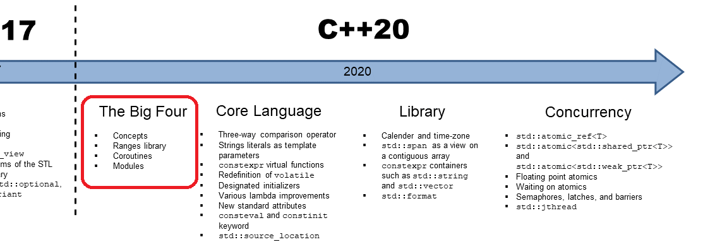

{: .mx-auto.d-block :}

C++11'de lambda ifadelerin gelmesi ve C++17 ile birlikte standart kütüphanede bulunan algoritmaların tamamen derleyici zamanında işlem yapabilmesi sayesinde, C++ ile yazılan kodların okunurluğu ve performansı gerçekten bir sıçrama yaşadı. Yazılan kodların derleyici zamanında çözümlenebilmesi, algoritmalarda kullanılan lamda ifadelerin optimize *(inline)* edilerek algoritmaların çalışma performanslarının artmış olması, RVO ve move semantics gibi yeniliklerin gelmesi, C++ için gerçekten büyük bir gelişme olarak kaydediliyor. Ancak, birbirine bağlı işlemlerin hala ayrı olarak yapılıyor olması bugüne kadar dilin sahip olduğu en büyük eksikliklerden biriydi. C# [*"LINQ"*][cs-linq], Java [*"Streams"*][jv-streams] gibi üst seviye dillerin sunduğu ve Haskell gibi ultra performans odaklı fonksiyonel dillerin bu alanda geliştirmiş oldukları çözümler, C++ dili için gerçekten bir baskı unsuruydu.

```cpp
int main()
{
  std::vector<int> ints{ 1, 2, 3, 4, 5, 6, 7, 8, 9 };
  std::vector<int> result;                         // (1)

  std::copy_if(ints.begin(), ints.end(),           // (2)
               std::back_inserter(result),
               [](int i) { return i % 2 == 0; });

  std::for_each(result.begin(), result.end(),      // (3)
                [](int& v) { v *= 2; });
}
```

Yukarıdaki gibi çok basit iki işlemi standart kütüphanede bulunan algoritmalar ile yaptığımızda, iki farklı döngü işletilmesi ve işlemler arasında kullanılan geçici nesnelere ihtiyaç duyulması, büyük veri setleri için performans ve bellek sorunlarına yol açmaktaydı. Bunun nedeni; standart kütüphanede bulunan algoritmaların, hevesli(anlık) hesaplama [*(Eager evaluation)*][eager-eval-wiki] olarak da bilinen, yazdığınız yerde çalıştırma prensibi ile çalışıyor olmalarıdır.  
Bu nedenle birden fazla algoritmayı tek veri seti için tek seferde çalıştırarak geçici nesnelerden kurtulmak mümkün olmuyordu.

## Ranges Kütüphanesi

C++20 standardıyla beraber gelen Ranges kütüphanesi, sahip olduğu tembel hesaplama [*(lazy evaluation)*][lazy-eval-wiki] mimarisi ve kütüphaneyle gelen yeni özellikler sayesinde, veri setleri üzerinde yapılan işlemlerin mümkün olan en performanslı şekilde tamamlanmasını sağlıyor.  

> Tembel Hesaplama Tekniğini anlattığım yazıya [buradan](2020-12-17-lazy-evaluation-ranges) ulaşabilirsiniz.  

İlk olarak 2015 yılında Eric Niebler tarafından açık kaynak olarak yayınlanan [Ranges][ranges-github] kütüphanesinin C++ standardına dahil olması, standart kütüphanede bulunan algoritmaların daha esnek bir yapıya bürünmesini sağlamakla birlikte, asenkron olarak işletilebilme imkanı da yaratıyor. [Coroutine][coro-cpp] kütüphanesi ile birlikte kullanıldığında, tamamen fonksiyonel ve asenkron program geliştirme imkanı sunan C++ dili, [Haskell](https://www.haskell.org/) gibi fonksiyonel diller ile olan açığını da kapatıyor.

[](https://www.youtube.com/watch?v=mFUXNMfaciE)

Gelin yeni gelen Ranges kütüphanesine daha yakından bakalım ve yazının başında yazdığımız kodu, Ranges kütüphanesini kullanarak tekrar yazalım:

```cpp
int main()
{
  std::vector<int> ints{ 1, 2, 3, 4, 5, 6, 7, 8, 9 };

  // (1)
  auto result = ints  
    | std::views::filter([] (auto i) { return i % 2 == 0; })  
    | std::views::transform([] (auto i) { return i *= 2; });
  
  // (2)
  std::cout << "typename of result: " << typeid(result).name() << "\n";
  
  // (3)
  for (auto i : result) {
    std::cout << "even numbers with doubled: " << i << "\n";
  }
}
```

Range kütüphanesinin kullanım şekli, yukarıdaki kodda görüldüğü gibi bazı özel operatörler ve kütüphanenin sağladığı yardımcı adaptör adı verilen gösterici *(view)* objeleri ile sağlanmaktadır.  
Range kütüphanesinde, veri setlerini kullanmak veya birden fazla operasyonu birleştirmek için logic **'|'** operatörü kullanılmaktadır; bu operatörün dönüş tipi, verilen/birleştirilen operasyonlar için range kütüphanesi tarafından yaratılan gösterici sınıflarıdır ve bütün işlemlerin sonucu bu nesneler aracılığıyla hesaplanır.

1. Range kütüphanesinde bulunan adaptörler yardımıyla, `ints` veri setinde bulunan çift sayıların, ikiyle çarpılmış hallerini almak istediğimizi belirten, iki farklı işlemi birleşiminden oluşan bir gösterici nesnesi *(view object)* hazırlanır

2. Farklı işlemleri birleştirerek hazırladığımız gösterici nesnesinin tipine baktığımız zaman, bileşimde verdiğimiz bütün işlemleri içerisinde barındıran özel bir sınıf olduğunu görmekteyiz  

    ```shell
    typename of result: struct ranges::transform_view<struct ranges::filter_view<struct ranges::ref_view<class std::vector<int,class std::allocator<int> > >,class `void __cdecl print_range_type(void)'::`2'::<lambda_1> >,class `void __cdecl print_range_type(void)'::`2'::<lambda_2> >
    ```

3. `result` gösterici nesnesi içerisinde hazır olan algoritma bileşimini for döngüsü içerisinde kademeli olarak çalıştırarak, sonuçları yazdırılır. Veri setleri için tanımlanan algoritmaların kademeli bir şekilde çalıştırılmasıyla birlikte, C++20 coroutine kütüphanesi kullanılarak kodun işleyişini asenkronlaştırmak mümkün hale gelmektedir.

C++20 standardı içerisinde Ranges kütüphanesiyle birlikte gelen başlıca özelliklere baktığımızda:

* **Erişim Sağlayıcılar**  

    | | | | |
    | :-----: | :------: | :------: | :-------: |  
    | [*begin*][rng-begin] | [*rbegin*][rng-rbegin] | [*cbegin*][rng-cbegin] | [*crbegin*][rng-crbegin] |  
    | [*end*][rng-end]   | [*rend*][rng-rend]   | [*cend*][rng-cend]   | [*crend*][rng-crend]   |  
    | [*size*][rng-size]  | [*data*][rng-data]   | [*cdata*][rng-cdata]  | [*empty*][rng-empty]   |  

* **Range Konseptleri**  

    | | | | |
    | :-----: | :------: | :------: | :-------: |  
    | [*range*][rng-range] | [*common_range*][rng-common-range]  | [*input_range*][rng-input-range]  | [*bidirectional_range*][rng-bidirectional-range] |  
    | [*borrowed_range*][rng-borrowed-range] | [*view*][rng-view]  | [*output_range*][rng-output-range] | [*random_access_range*][rng-rnd-access-range] |  
    | [*sized_range*][rng-sized-range] | [*viewable_range*][rng-viewable-range] | [*forward_range*][rng-forward-range] | [*contiguous_range*][rng-cont-range] |  

* **Range Üreteçleri**
  * [**empty**](https://en.cppreference.com/w/cpp/ranges/empty_view)  : Boş bir gösterici objesi yaratmak için kullanılır  

    ```cpp
        std::ranges::empty_view<int> e;
        static_assert(std::ranges::empty(e));
        static_assert(0 == e.size());
    ```

  * [**single**](https://en.cppreference.com/w/cpp/ranges/single_view) : Tek elemanlı bir gösterici objesi yaratmak için kullanılır
  * [**iota**](https://en.cppreference.com/w/cpp/ranges/iota_view)   : Başlangıç noktası belirtilen sayıdan başlayarak artan bir gösterici objesi yaratmak için kullanılır

    ```cpp
      int main()
      {
        for (int i : std::ranges::iota_view{1, 10})
          std::cout << i << ' ';
        std::cout << '\n';

        for (int i : std::views::iota(1, 10))
          std::cout << i << ' ';
        std::cout << '\n';

        for (int i : std::views::iota(1) | std::views::take(9))
          std::cout << i << ' ';
        std::cout << '\n';
      }
    ```

    ```shell
    Output:
      1 2 3 4 5 6 7 8 9
      1 2 3 4 5 6 7 8 9
      1 2 3 4 5 6 7 8 9
    ```

  * [**counted**](https://en.cppreference.com/w/cpp/ranges/view_counted) : Başka bir range içerisinden belirlenen sayıda elemanı gösteren bir gösterici objesi yaratmak için kullanılır
  
    ```cpp
      int main()
      {
        int a[] = {1, 2, 3, 4, 5, 6, 7, 8, 9, 10};
        for(int i : std::views::counted(a, 3))
          std::cout << i << ' ';
        std::cout << '\n';

        const auto il = {1, 2, 3, 4, 5};
        for (int i : std::views::counted(il.begin() + 1, 3))
          std::cout << i << ' ';
        std::cout << '\n';
      }
    ```

    ```shell
    Output:
      1 2 3
      2 3 4
    ```

* **Range Adaptörleri**
  * [**all**](https://en.cppreference.com/w/cpp/ranges/all_view)        : Verilen nesnenin bütün elemanlarını tutan gösterici objesi yaratmak için kullanılır
  
    ```cpp
      int main()
      {
        std::vector<int> v{0,1,2,3,4,5};
        for(int n : std::views::all(v) | std::views::take(2) ) {
          std::cout << n << ' ';
        }
      }
    ```

    ```shell
    Output:
      0 1
    ```

  * [**ref_view**](https://en.cppreference.com/w/cpp/ranges/ref_view)   : Başka bir gösterici objesini kullanan bir gösterici objesi yaratmak için kullanılır

    ```cpp
      const std::string s{"cosmos"};

      const std::ranges::take_view tv{s, 3};
      const std::ranges::ref_view rv{tv};

      std::cout
        << std::boolalpha
        << "call empty() : " << rv.empty() << '\n'
        << "call size()  : " << rv.size() << '\n'
        << "call begin() : " << *rv.begin() << '\n'
        << "call end()   : " << *(rv.end()-1) << '\n'
        << "call data()  : " << rv.data() << '\n'
        << "call base()  : " << rv.base().size() << '\n' // ~> tv.size()
        << "range-for    : ";

      for (const auto c: rv) { std::cout << c; }
      std::cout << '\n';
    ```

    ```shell
    Output:
      call empty() : false
      call size()  : 3
      call begin() : c
      call end()   : s
      call data()  : cosmos
      call base()  : 3
      range-for    : cos
    ```

  * [**filter**](https://en.cppreference.com/w/cpp/ranges/filter_view)     : Verilen karşılaştırıcı ile filtreleme yapan bir gösterici objesi yaratmak için kullanılır
  * [**transform**](https://en.cppreference.com/w/cpp/ranges/transform_view)  : Range içerisinde yer alan nesneleri dönüştüren gösterici objesi yaratmak için kullanılır
  
    ```cpp
      int main()
      {
        std::vector<int> ints{0, 1, 2, 3, 4, 5};
        auto even = [](int i) { return 0 == i % 2; };
        auto square = [](int i) { return i * i; };

        for (int i : ints | std::views::filter(even) | std::views::transform(square)) {
          std::cout << i << ' ';
        }
      }
    ```

    ```shell
    Output:
      0 4 16
    ```

  * [**take**](https://en.cppreference.com/w/cpp/ranges/take_view)       : Range içerisinden istenilen eleman sayısı kadar elemanı gösteren gösterici objesi yaratmak için kullanılır
  * [**take_while**](https://en.cppreference.com/w/cpp/ranges/take_while_view) : Range içerisinden verilen koşul sağlandığı sürece elemanları gösteren bir gösterici objesi yaratmak için kullanılır
  
    ```cpp
      auto print = [](char x) { std::cout << x; };

      int main()
      {
        constexpr char pi[] { '3', '.', '1', '4', '1', '5', '9', '2', '6', '5' };

        std::ranges::for_each(pi | std::ranges::views::take(8), print);
        std::cout << '\n';
        std::ranges::for_each(std::ranges::take_view{pi, 4}, print);
        std::cout << '\n';

        for (int year : std::views::iota(2017)
                      | std::views::take_while([](int y) { return y <= 2020; })) {
          std::cout << year << ' ';
        }
        std::cout << '\n';
      }
    ```

    ```shell
    Output:
      3.141592
      3.14
      2017 2018 2019 2020
    ```

  * [**drop**](https://en.cppreference.com/w/cpp/ranges/drop_view)       : Range içerisinden verilen sayı kadar elemanı yoksayan bir gösterici objesi yaratmak için kullanılır
  * [**drop_while**](https://en.cppreference.com/w/cpp/ranges/drop_while_view) : Range içerisinden verilen koşul sağlandığı sürece range elemanlarını yoksayan bir gösterici objesi yaratmak için kullanılır
  
    ```cpp
      int main()
      {
        std::vector nums = { 1, 2, 3, 4, 5, 6, 7, 8, 9 };

        for (int i : nums | std::views::drop(2))
          std::cout << i << ' ';
        std::cout << '\n';

        for (int i : std::views::iota(1, 10) | std::views::drop(2))
          std::cout << i << ' ';
        std::cout << '\n';

        static constexpr auto v = {0, 1, 2, 3, 4, 5, 6, 7, 8, 9};
        for (int n : v | std::views::drop_while([](int i) { return i < 3; })) {
            std::cout << n << ' ';
        }
      }
    ```

    ```shell
    Output:
      3 4 5 6 7 8 9
      3 4 5 6 7 8 9
      3 4 5 6 7 8 9
    ```
  
  * [**reverse**](https://en.cppreference.com/w/cpp/ranges/reverse_view) : Range içerisindeki elemanları tersten işleten bir gösterici objesi yaratmak için kullanılır
  
    ```cpp
      int main()
      {
        static constexpr auto il = {3, 1, 4, 1, 5, 9};
        std::ranges::reverse_view rv {il};

        for (int i : rv)
            std::cout << i << ' ';
        std::cout << '\n';

        for(int i : il | std::views::reverse)
            std::cout << i << ' ';
      }
    ```

    ```shell
    Output:
      9 5 1 4 1 3
      9 5 1 4 1 3
    ```
  
---

[cs-linq]: https://docs.microsoft.com/tr-tr/dotnet/csharp/programming-guide/concepts/linq/
[jv-streams]: https://docs.oracle.com/javase/8/docs/api/java/util/stream/package-summary.html
[eager-eval-wiki]: https://en.wikipedia.org/wiki/Eager_evaluation
[lazy-eval-wiki]: https://en.wikipedia.org/wiki/Lazy_evaluation
[ranges-github]: https://github.com/ericniebler/range-v3
[coro-cpp]: https://en.cppreference.com/w/cpp/language/coroutines
[rng-begin]: https://en.cppreference.com/w/cpp/ranges/begin
[rng-rbegin]: https://en.cppreference.com/w/cpp/ranges/rbegin
[rng-cbegin]: https://en.cppreference.com/w/cpp/ranges/cbegin
[rng-crbegin]: https://en.cppreference.com/w/cpp/ranges/crbegin
[rng-end]: https://en.cppreference.com/w/cpp/ranges/end
[rng-rend]: https://en.cppreference.com/w/cpp/ranges/rend
[rng-cend]: https://en.cppreference.com/w/cpp/ranges/cend
[rng-crend]: https://en.cppreference.com/w/cpp/ranges/crend
[rng-size]: https://en.cppreference.com/w/cpp/ranges/size
[rng-data]: https://en.cppreference.com/w/cpp/ranges/data
[rng-cdata]: https://en.cppreference.com/w/cpp/ranges/cdata
[rng-empty]: https://en.cppreference.com/w/cpp/ranges/empty
[rng-range]: https://en.cppreference.com/w/cpp/ranges/range
[rng-common-range]: https://en.cppreference.com/w/cpp/ranges/common_range
[rng-input-range]: https://en.cppreference.com/w/cpp/ranges/input_range
[rng-bidirectional-range]: https://en.cppreference.com/w/cpp/ranges/bidirectional_range
[rng-borrowed-range]: https://en.cppreference.com/w/cpp/ranges/borrowed_range
[rng-view]: https://en.cppreference.com/w/cpp/ranges/view
[rng-output-range]: https://en.cppreference.com/w/cpp/ranges/output_range
[rng-rnd-access-range]: https://en.cppreference.com/w/cpp/ranges/random_access_range
[rng-sized-range]: https://en.cppreference.com/w/cpp/ranges/sized_range
[rng-viewable-range]: https://en.cppreference.com/w/cpp/ranges/viewable_range
[rng-forward-range]: https://en.cppreference.com/w/cpp/ranges/forward_range
[rng-cont-range]: https://en.cppreference.com/w/cpp/ranges/contiguous_range

## Range Kütüphanesi vs STL Algoritmaları

Range kütüphanesinin gerçek gücünü karşılaştırmak ve karmaşık algoritmaların nasıl sade kod parçaları ile
kodlanabileceğini görmek için örnek bir problem üzerinden ilerleyelim. Problemin çözümünü hem STL algoritmaları, hem de range
kütüphanesi ile kodlayarak, iki yaklaşımın performansını ve koda olan etkisini inceleyelim.

### Problem

Aşağıda tanımlanan öğrenci veri yapısı için, verilen öğrencilerden not ortalaması 80 ve üstü olanların, matematik notunu
60 olarak değiştirerek, öğrencinin adını ve yeni not ortalamasını listeleyen bir uygulama geliştirelim:

```cpp
// örnekteki basitliği korumak adına bütün bilgiler tek bir yapıda tutulmuştur
struct ogrenci
{
  string adi;
  string soy_adi;
  float mat, fizik, turkce, dil, beden, ...;
  float ortalama() const { return ...; }
};

struct ogrenci_ve_ortlamasi
{
  std::string_view isim;
  float not_ortalamasi{};
};
```

Standark kütüphanedeki algoritmaları kullanarak kodumuzu yazmak istediğimizde, bize verilen liste içerisinden ortalamayı geçen
öğrenciler için ayrı bir liste hazırlayarak, yeni liste içerisindeki öğrencilerin matematik notunu değiştirmeli ve yeni not
ortalaması ile öğrencinin adını tutan ayrı bir veri yapısıyla liste oluşturmamız gerekmektedir. Yani:

```cpp
void solve_with_stl(const vector<ogrenci>& ogrenci_listesi)
{
  vector<reference_wrapper<const ogrenci>> ort_ustu_ogrenciler;     // (1)
  copy_if(begin(ogrenci_listesi), end(ogrenci_listesi),
          back_inserter(ort_ustu_ogrenciler),
          [](const auto& o)
          {
            return o.ortalama() >= 80.f;
          });
  
  vector<ogrenci_ve_ortlamasi> sonuc_listesi;                       // (2)
  sonuc_listesi.resize(ort_ustu_ogrenciler.size());
  transform(begin(ort_ustu_ogrenciler), end(ort_ustu_ogrenciler),
            begin(sonuc_listesi),
            [](const auto& ogr)
            {
              auto& o = ogr.get();                                  // (3)
              const auto yeni_ortalama = mean_of(60.f, o.fizik,
                 o.turkce, o.dil, o.beden, o.geometri, o.muzik);
              return ogrenci_ve_ortlamasi{ o.isim, yeni_ortalama };
            });

  for (const auto& o : sonuc_listesi) {                             // (4)
    std::cout
      << "ogrenci: " << o.isim
      << "\tyeni ortalamasi: " << o.not_ortalamasi << "\n";
  }
}
```

1. Ortalamanın üstündeki öğrencileri, ana listeden alarak ayrı bir listede tekrar değerlendirmemiz gerekiyor. Bunun için ana listedeki öğrenci sınıflarının referanslarını tutan ayrı bir liste yaratarak, istenilen öğrencilerin referanslarını `copy_if` fonksiyonu ile kopyalıyoruz
    >Not: `reference_wrapper<const ogrenci>` tipi aslında `const ogrenci&` anlamına gelmektedir. Öğrenci sınıfını kopyalamak alan yönetimi
    >açısından referansını kopyalamaktan daha pahalı olacağı için, burada referansını kullanmak daha optimal.

2. Sonrasında bu öğrencileri, yeni hesaplanacak not ortalamaları ile ayrı bir veri yapısında tutulması istenildiği için, ikinci bir liste yaratıyoruz.
Burada `sonuc_listesi` içerisinde tutulacak öğrenci sayısını daha önce hesapladığımız için, vektörümüzün alanını önden ilkleyerek en hızlı şekilde çalışmasını garantiliyoruz

3. `transform` fonksiyonu ile `ort_ustu_ogrenciler` listesindeki bilgileri kullanarak yeni veri yapımızı dolduruyoruz; bunu yaparken kullandığımız referans tutucu
nesnesinden öğrenci sınıfına tekrar ulaşmamız gerekiyor. Sonrasında yeni matematik notu ile ortalama hesaplanarak geriye istenilen veri yapısını döndürülüyor

4. En son olarak bütün hesaplamalardan sonra, yeni not ortalamaları ile öğrencilerin isimlerini konsola yazdırıyoruz.

Aslında çok basit olan, filtreleme ve dönüşüm işlemleri için yazdığımız kodun uzunluğu ve karmaşıklığı ne kadar fazla değil mi? Aynı şekilde referans tutucuların kullanılması, birden fazla geçici listelerin yaratılması gibi işlemler yüzünden ileride kodumuzda hataların çıkması olası.

---

Gelin şimdi bir de C++20 ile gelen range kütüphanesi ile aynı kodu yazalım:

```cpp
void solve_with_ranges(const vector<ogrenci>& ogrenci_listesi)
{
  auto result = ogrenci_listesi
    | std::views::filter(
      [](const ogrenci& o) { return o.ortalama() >= 80.f; })    // (1)
    | std::views::transform(
      [](const ogrenci& o)
      {
        auto yeni_ortalama = mean_of(60.f, o.fizik, o.turkce,   // (2)
          o.dil, o.beden, o.geometri, o.muzik);
        return ogrenci_ve_ortlamasi{ o.isim, yeni_ortalama };
      });

  for (const auto& ogr : result)                                // (3)
  {
    std::cout
      << "ogrenci: " << ogr.isim
      << "\tyeni ortalamasi: " << ogr.not_ortalamasi << "\n";
  }
}
```

1. Ortalama üstü öğrencileri filtreleyecek olan range adaptörünü tanımlıyoruz

2. Filtreden geçen öğrenci sınıfları için yeni ortalamayı hesaplayarak istenilen veri yapısında dönecek olan dönüştürücü nesnesini tanımlıyarak bizden istenen algoritmayı hazırlamış oluyoruz

3. Hazırladığımız range gösterici nesnesi üzerinden sonuçları alarak kademeli olarak konsola yazdırıyoruz ve işimiz burada tamamlanmış oluyor.

İki implementasyon da çalıştırıldığı zaman aynı sonuçları göstermektedir. STL algoritmaları ile gerçekleştirdiğimiz çözümde, algoritmalar yazıldıkları yerde çalıştırıldıkları için geçici nesnelerin kullanılması gerekirken; range kütüphanesinin kullandığı tembel yaklaşım mimarisi ve adaptör nesnelerin birbirileri ile birleştirilebilmesi sayesinde fazladan bir nesne kullanımı olmadan işlemleri yapabiliyoruz.  

Yeni standart ile birlikte gelen range kütüphanesi, hem yazdığımız kodların okunurluğunu arttırırken, hem de çalışma performansını iyileştirerek C++ dilinin kullanımını bir seviye daha yukarıya taşımaktadır. C++20 ile birlikte gelen Range ve Coroutine kütüphanelerinin sahip olduğu yetenekler birleştirildiğinde, yazılan uygulamaların
asenkron hale getirilmesi sorunsuz bir şekilde yapılabilmektedir. C++ dilinin fonksiyonel programlama alanında sağladığı bu güç, Haskell gibi performans odaklı ve fonksiyonel yazılım dilleriyle aynı performansı sunmaktadır.

---

> Yukarıdaki örneğe ait bütün kodlar aşağıda derlenebilir olarak paylaşılmıştır.

<script src="https://gist.github.com/nixiz/61207277e61f7979fcdaa0ca8d9df6da.js"></script>
