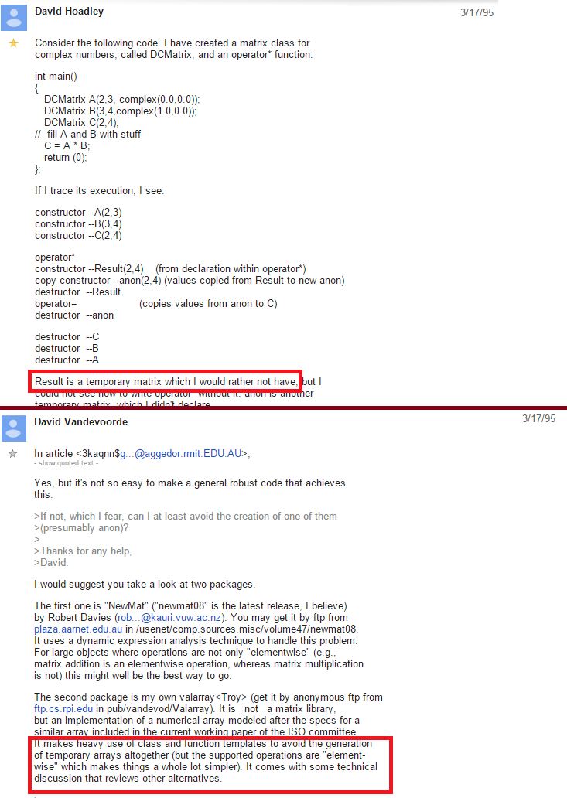
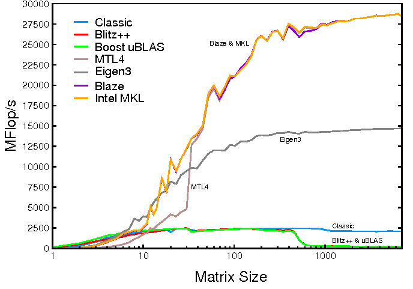

C++20 standartı ile gelen [Range kütüphanesini](../2020-12-17-cpp20-ranges) sizlere aktardığım yazımda, kütüphanenin sahip olduğu
tembel hesaplama yaklaşımından ve dile kazandırdığı faydalardan bahsetmiştim. Range kütüphanesini
tanıtırken teknik detaylara yer vermeden, sahip olduğu adaptörleri ve üreteçleri örnek kullanımları
ile aktarmaya çalışmıştım. Ancak, tembel hesaplama tekniğini anlamadan, ranges kütüphanesini anlamak pek
mümkün olmayacağı için, sizlere biraz lazy evaluation kavramından bahsetmek ve range kütüphanesinin
bunu nasıl sağladığını anlatmak istiyorum.

{: .mx-auto.d-block :}

İlk olarak 1995 yılında [Expression Templates](https://en.wikipedia.org/wiki/Expression_templates) tekniği ile karşımıza çıkan tembel yaklaşım mimarisi, [Blaze](https://bitbucket.org/blaze-lib/blaze/src/master/), [Boost.UBlas](https://www.boost.org/doc/libs/1_75_0/libs/numeric/ublas/doc/index.html), [Blitz](https://github.com/blitzpp/blitz) gibi numerik hesaplamalar
için geliştirilen kütüphanelerin çekirdek mimarisini oluşturmaktadır. Tembel yaklaşım ile hesaplama,
temelinde çok basit bir mimariye sahip olmasına rağmen, performans etkisi inanılmaz ölçülerde olabilmektedir.

{: .mx-auto.d-block :}

Tembel yaklaşım mimarisinin bu zamana kadar bilinmesine rağmen geliştiriciler tarafından zorunda kalınmadıkça
tercih edilmemesinin sebebi, Modern C++ öncesinde `auto` tip çıkarıcısı, `variadic templates`, `labmda expressions`
gibi sentaksı rahatlatan özelliklerin **bulunmamasıydı**. C++11 ve sonrasında dile getirilen birçok yenilik ve
özellik ile birlikte, range kütüphanesi gibi tembel yaklaşım kullanan kütüphanelerin anlaşılırlığı ve kullanılabilirliği,
her seviyeden geliştirici tarafından anlaşılır hale gelmiştir.

### Eager Evaluation - Anlık Hesaplama

Normal şartlar altında yazdığımız kodları tasarlarken, kodların yazıldığı yerde çalıştırıldığını, sonucunda da geriye
bir şey döndürüldüğünü veya bir işlem yapıldığını kabul ederek tasarımlarımızı gerçekleştiririz. Anlık hesaplama yöntemi ile
yazdığımız kodların çağrıldıkları yerde işletildiklerini biliyor olmak, kod üzerinde determinizmi sağlaması ve daha kontrollü
olması sayesinde, bizlerin en sık tercih ettiği yöntem haline gelmiştir.

Bu yöntem ile çarpım işlemi gerçekleştiren `int multiply(int x, int y)` fonksiyonunu yazmak istediğimizde, fonksiyonun yapısı
aşağıdaki gibi olacaktır:

```cpp
1. int multiply(int x, int y) { return x * y; }
2.
3. int main() {
4.   int x = 2, y = 3;
5.   int tmp = multiply(x, y);
6.   int result = multiply(4, tmp);
7.   // ... and many other calculations ...
8.  cout << "result: " << result << "\n";
9. }
```

Anlık hesaplama tekniğinde `multiply` fonksiyonu, verilen değerlerin çarpımını anlık olarak hesaplayarak geriye 6 değerini
`tmp` değişkenine ***5.*** satırda eşitleyecektir. Sonra, hesapladığı geçici değişken ile diper çarpım işlemini gerçekleştirerek
sonucunu `result` değişkenine atayacaktır. Konsola yazdırıldığı yere kadar hiç kullanılmamış olsa da hesaplanmış olan `result`
değeri, uygulama içerisinde tutularak ***8.*** satırda kullanılacaktır.

### Lazy Evaluation - Tembel Hesaplama Mimarisi

Eğer `multiply` fonksiyonu tembel hesaplama mimarisini kullanmış olsaydı, çarpım işlemleri birleştirilerek *8.* satırda
sonuç kullanılmak istenene kadar işletilmeyecekti. Bu sırada `result` değişkeni yeni yöntemde, işlemlerin sonucu yerine,
verilen işlemlerin bilgilerini tutan ara bir nesne olacaktı. Bu sayede sonucu hesapyalacak çarpım işlemlerini son ana kadar
öteleyerek, yalnızca gerektiği yerde çalıştırmasını sağlayabilecektir.

Yukarıdaki işlemleri tembel yaklaşımla yapmak için, çözüme sorundan başlayarak ilerleyelim ve ilk önce `multiply` fonksiyonumuzu
tipten bağımsız ve geriye çarpım işlemlerini tutacak olan tembel sınıfı dönecek şekilde tekrar yazalım:

```cpp
template <typename T1, typename T2>
struct lazy_t;                        // (1)

template <typename T1, typename T2>   // (2)
lazy_t<T1, T2> multiply(T1 x, T2 y)
{
  return lazy_t<T1, T2>(x , y);       // (3)
}
```

1. `lazy_t` adını verdiğimiz, çarpım işlemlerini tutarak son ana kadar öteleyecek olan ara sınıfımızı tanımlayalım. Tembel hesaplama
için kullanacağımız ana yapı bu sınıf olacak ve çarpım işlemlerini işlemleri sınıfımız üzerinden tamamlıyor olacağız

2. Çarpım işlemine gönderilecek argümanlar, `int` olabileceği gibi bir önceki çarpım işleminden dönen `lazy_t` sınıfı da
olabileceğinden, argüman tiplerininin tipten bağımsız olması gerekmektedir. Bu nedenle `multiply` fonksiyonumuzu iki farklı template
tip alan bir yapıda gerçekleştiriyoruz

3. `multiply` fonksiyonunun, sadece `T1` ve `T2` tip bilgileri ile birlikte aldığı argümanları `lazy_t` sınıfına aktararak geriye
`lazy_t<T1, T2>` sınıfı dönmesi yeterli. Fonksiyonun döndürdüğü sınıfın sahip olduğu tip bilgileri ve değerler, verilen bütün işlemleri
birleştirilmesinde kullanılarak nihai sonucun hesaplanması sağlanacak

    > Modern C++ ile gelen `auto` tip çıkarıcısı olmadan önce, tembel yaklaşımla yaratılan ara sınıfların tiplerinin net olarak tanımlanması
    >gerekiyordu.  
    > İki veya üç işlemin birleşiminden ortaya çıkan ara sınıfların bile tiplerinin belirlenmesi veya yazılmasının çok zor olmasından dolayı
    > C++'da tembel hesaplama yaklaşımıyla kod yazılması tercih edilmiyordu.

Tembel hesaplama yaklaşımını sunan, `multiply` fonksiyonunun geri döndürüğü `lazy_t` sınımızı geliştirmeye başlayalım. İki farklı template
tip alan sınıfımızın yapısı aşağıdaki gibi olacaktır:

```cpp
template <typename T1, typename T2>
struct lazy_t
{
  lazy_t(const T1& first_,
         const T2& second_)
    : first(first_)
    , second(second_) { }

  template <typename result_t>
  operator result_t() const {
    return first * second;      // (2)
  }
private:
  T1 first;                     // (1)
  T2 second;                    // (1)
};
```

1. Yaratıldığı tip bilgileri ile verilen değişkenleri saklamalıyız; bu değişkenleri sonuç hesaplanacağı zaman kullanacağız

2. Tembel sınıfımızı sonuç istendiği zaman çarpma işlemini yapacak şekilde tür atanma operatörünün özelleştirerek,
sınıfımızın tuttuğu hesaplamaları yapmasını sağlıyoruz.  
    >Örneği basit ve yalın tutmak adına, `int result = lazy_t<...>;` işlemi yapıldığında hesaplamaların yapılmasını sağladım.

Yazdığımız kodları birleştirelim ve tembel hesaplama tekniğiyle bir çarpım işlemi gerçekleştirelim:

```cpp
1.  int main()
2.  {
3.    int x{ 1 }, y{ 2 }, z{ 3 };
4.    auto lazy_y_z   = multiply(y, z);
5.    auto lazy_x_y_z = multiply(x, lazy_y_z);
6.
7.    std::cout << "type of lazy_x_y  : "
8.      << typeid(lazy_y_z).name() << "\n";
9.
10.   std::cout << "type of lazy_x_y_z: "
11.     << typeid(lazy_x_y_z).name() << "\n";
12.
13.   int result = lazy_x_y_z;
14.   std::cout << "result of lazy operations: "
15.     << result << "\n";
16. }
```

```shell
8.  type of lazy_x_y  : struct lazy::lazy_t<int, int>
11. type of lazy_x_y_z: struct lazy::lazy_t<int, struct lazy::lazy_t<int, int> >
14. result of lazy operation: 6
```

Yukarıda yazdığımız kod başarıyla çalışacak ve `int result = lazy_x_y_z;` dediğimiz yerde çarpım işlemi
gerçekleşerek sonucu `result` değişkenine atayacaktır. Fakat bunu yapabilmesi için son bir düzenlemeye daha
ihtiyacımız var.  
Çarpım işlemlerini birleştirdiğimizde, bütün çarpımları yapacak olan son tembel nesnemizin
tuttuğu tiplere bakacak olursak: `T2` template tipinin `int` yerine bir önceki çarpım işlemi için yaratılan
tembel nesnein olduğunu göreceğiz. `int` tipi ile **X** ve **Y** tiplerinden oluşturulan `lazy<X, Y>` sınıfı
için özelleştirilmiş bir '*' çarpım operatörünü yazmamız gerekiyor.

```cpp
template <typename result_t, typename U1, typename U2>
result_t operator*(const result_t& left, const lazy_t<U1, U2>& oth)
{
  return left * oth.first * oth.second;
}
```

> `oth.first` veya `oth.second` değişkenlerinin tiplerinin farklı `lazy<T1, T2>` sınıflarından oluşturulan
> nesneler olabileceğini unutmayın!  
> Böyle bir durumda 'operator*(...)' çarpım operatörü ilgili çarpım işlemi için de çağrılacak ve bu sayede çarpım işlemleri
> bağlantılı bir şekilde tamamlanacaktır.

Sağ tarafında `lazy_t` türünden sınıf alan çarpım operatörü özelleştirmesi sayesinde, geliştirdiğimiz tembel çarpım
fonksiyonumuz istediğimiz kadar çarpım işlemini birleştirerek çarpma işlemi için birleştirebilecektir.

Yazdığımız kodları birleştirirsek kodumuzun son hali aşağıdaki gibi olacaktır:

```cpp
#include <iostream>

template <typename T1, typename T2>
struct lazy_t
{
  lazy_t(const T1& first_, const T2& second_)
    : first(first_)
    , second(second_) { }

  template <typename result_t>
  operator result_t() const {
    return first * second;
  }
private:
  template <typename result_t, typename U1, typename U2>
  friend result_t operator*(const result_t& left,
                            const lazy_t<U1, U2>& oth);

  T1 first;
  T2 second;
};

template <typename result_t, typename U1, typename U2>
result_t operator*(const result_t& left,
                   const lazy_t<U1, U2>& oth)
{
  return left * oth.first * oth.second;
}

template <typename T1, typename T2>
lazy_t<T1, T2> multiply(T1 x, T2 y)
{
  return lazy_t<T1, T2>(x, y);
}

int main()
{
  int x{ 2 }, y{ 2 }, z{ 2 };
  auto lazy_result = multiply(x, multiply(y, z));
  std::cout << "result of lazy operations: " << int(lazy_result) << "\n";
}
```
